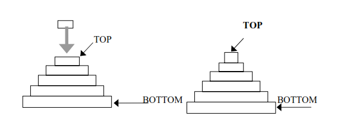

# <h1 align="center">Laporan Praktikum Modul Stack</h1>
<p align="center">Arvinanto Bahtiar</p>

## Dasar Teori
Stack merupakan struktur data linear yang dapat diakses hanya pada satu sisi untuk menyimpan dan mengambil data, yakni melalui bagian top atau bagian ujung data teratas dari tumpukan tersebut. Stack merupakan bentuk khusus dari suatu struktur data, dimana node yang ditambahkan ke dalam list dan diambil dari list hanya pada kepalanya, atau dengan prinsip pengolahannya adalah last-in first-out (LIFO).  Stack dapat diimplementasikan menggunakan array atau linked list<br/>

Berikut adalah beberapa operasi umum pada stack: <br/>
- Push (Masukkan): Menambahkan elemen ke dalam tumpukan pada posisi paling atas atau ujung.
- Pop (Keluarkan): Menghapus elemen dari posisi paling atas atau ujung tumpukan.
- Top (Atas): Mendapatkan nilai atau melihat elemen teratas pada tumpukan tanpa menghapusnya.
- IsEmpty (Kosong): Memeriksa apakah tumpukan kosong atau tidak.
- IsFull (Penuh): Memeriksa apakah tumpukan penuh atau tidak (terutama pada implementasi tumpukan dengan kapasitas terbatas).
- Size (Ukuran): Mengembalikan jumlah elemen yang ada dalam tumpukan.
- Peek (Lihat): Melihat nilai atau elemen pada posisi tertentu dalam tumpukan tanpa menghapusnya.
- Clear (Hapus Semua): Mengosongkan atau menghapus semua elemen dari tumpukan.
- Search (Cari): Mencari keberadaan elemen tertentu dalam tumpukan.

## Guided 
```C++
#include <iostream>
using namespace std;

string arrayBuku[5];
int maksimal = 5, top = 0;

bool isFull() {
    return(top == maksimal);
}

bool isEmpty() {
    return(top == 0);
}

void pushArrayBuku(string data) {
    if(isFull()) {
        cout << "Data telah penuh" << endl;
    } 
    else {
        arrayBuku[top] = data;
        top++;
    }
}

void popArrayBuku() {
    if(isEmpty()) {
        cout << "Tidak ada data yang dihapus" << endl;
    } 
    else {
        arrayBuku[top-1] = "";
        top--;
    }
}

void peekArrayBuku(int posisi) {
    if(isEmpty()) {
        cout << "Tidak ada data yang bisa dilihat" << endl;  
    } 
    else {
        int index = top;
        for (int i = 1; i <= posisi; i++) {
            index--;
        }
        cout << "Posisi ke " << posisi << " adalah " << arrayBuku[index] << endl;
    }
}

int countStack() {
    return top;
}

void changeArrayBuku(int posisi, string data) {
    if(posisi > top) {
        cout << "Posisi melebihi data yang ada" << endl;
    }
    else {
        int index = top;
        for(int i = 1; i <= posisi; i++) {
            index--;
        }
        arrayBuku[index] = data;
    }
}

void destroyArrayBuku() {
    for(int i = top; i >= 0; i--) {
        arrayBuku[i] = " ";
    }
    top = 0;
}

void cetakArrayBuku() {
    if(isEmpty()) {
        cout << "Tidak ada data yang dicetak" << endl;
    }
    else {
        for(int i = top - 1; i >= 0; i--) {
            cout << arrayBuku[i] << endl;
        }
    }
}

int main() {
    // Push untuk memasukkan input ke dalam stack (Input pertama berada di paling bawah dan input terbaru di paling atas stack)
    pushArrayBuku("Kalkulus"); 
    pushArrayBuku("Struktur Data");
    pushArrayBuku("Matematika Diskrit");
    pushArrayBuku("Dasar Multimedia");
    pushArrayBuku("Inggris");

    // Cetak untuk menampilkan seluruh stack yang telah diinput user
    cetakArrayBuku();
    cout << "\n";

    cout << "Apakah data stack penuh? " << isFull() << endl;
    cout << "Apakah data stack kosong? " << isEmpty() << endl;
    
    // Peek untuk cek isi stack dengan 
    peekArrayBuku(2);
    // Pop untuk menghapus data pada posisi pertama
    popArrayBuku();

    cout << "Banyaknya data = " << countStack << endl;

    // Change untuk mengganti data pada suatu posisi dengan data baru
    changeArrayBuku(2, "Bahasa Jerman");
    cetakArrayBuku();

    cout << "\n";

    destroyArrayBuku();
    cout << "Jumlah data setelah dihapus: " << top << endl;

    cetakArrayBuku();

    return 0;
}
```

### Output:
_2311102154_Naufal Geraldo Putra Pramudianartono.png>)

Berikut adalah contoh pengunaan stack yang diinplementasikan menggunakan array.

## Unguided 

### 1. Buatlah program untuk menentukan apakah kalimat tersebut yang diinputkan dalam program stack adalah palindrom/tidak. Palindrom kalimat yang dibaca dari depan dan belakang sama. Jelaskan bagaimana cara kerja programnya.
```C++
#include <iostream>
#include <stack>
#include <cctype>

using namespace std;

bool is_palindrom_154(string word_154) {
    stack<char> letter_stack_154;
    string cleaned_word_154;
    for(char w: word_154) {
        if(isalnum(w)) {
            cleaned_word_154 += tolower(w);
            letter_stack_154.push(tolower(w));
        }
    } 
    for(char w: cleaned_word_154) {
        if(w != letter_stack_154.top()) {
            return false;
        }
        letter_stack_154.pop();
    }
    return true;
}

int main() {
    string input_154;
    cout << "==== Program Deteksi Palindrom Naufal Geraldo ====" << endl;
    cout << "\n";
    cout << "Masukkan sebuah string: ";
    getline(cin, input_154);
    if (is_palindrom_154(input_154)) {
        cout << "String tersebut adalah palindrom" << endl;
    }
    else {
        cout << "String tersebut bukan palindrom" << endl; 
    }

    return 0;
}
```

#### Output:
_2311102154_Naufal Geraldo Putra Pramudianartono.png>)

- Fungsi is_palindrom_154(string word_154): <br/>
  1. Menerima sebuah string word_154 sebagai parameter.
  2. Membuat sebuah stack bernama letter_stack_154 yang akan digunakan untuk menyimpan karakter dari string yang sudah dimodifikasi.
  3. Membuat sebuah string cleaned_word_154 yang akan menyimpan versi yang sudah dimodifikasi dari string input. String ini akan hanya terdiri dari karakter alfanumerik dan dalam huruf kecil.
  4. Melakukan iterasi melalui setiap karakter w dalam string word_154.
  5. Jika karakter w adalah alfanumerik, maka karakter tersebut akan ditambahkan ke dalam cleaned_word_154 dalam huruf kecil menggunakan tolower(w) dan juga ditambahkan ke dalam stack letter_stack_154.
  6. Setelah selesai iterasi, kita memiliki cleaned_word_154 yang hanya berisi karakter alfanumerik dalam huruf kecil dan letter_stack_154 yang berisi karakter yang sama.
  7. Dilakukan iterasi lagi melalui setiap karakter w dalam cleaned_word_154.
  8. Pada setiap iterasi, karakter w dibandingkan dengan karakter teratas stack letter_stack_154. Jika tidak sama, maka string tidak palindrom dan fungsi mengembalikan false. Jika setelah semua iterasi dilakukan dan tidak ada perbedaan, maka string dianggap palindrom dan fungsi mengembalikan true.
- Fungsi main(): <br/>
  1. string input_154 dibuat untuk menyimpan input dari user.
  2. User memasukkan sebuah string.
  3. Memanggil fungsi is_palindrom_154(input_154) untuk memeriksa apakah string tersebut merupakan palindrom atau bukan.
  4. Menampilkan hasil dari pengecekan palindrom.

### 2. Buatlah program untuk melakukan pembalikan terhadap kalimat menggunakan stack dengan minimal 3 kata. Jelaskan output program dan source codenya beserta operasi/fungsi yang dibuat?
```C++
#include <iostream>
#include <stack>

using namespace std;

string normal_154(string word_154) {
  stack<char> letter_stack_154; 
  for(int i = 0; i < word_154.length(); i++) { 
    letter_stack_154.push(word_154[i]);
  }
  string reverse_154; 
  while(!letter_stack_154.empty()) {
    reverse_154 += letter_stack_154.top();
    letter_stack_154.pop();
  }
  return reverse_154;
}

int main() {
  string word_154;
  cout << "==== Program Pembalik Kata Naufal Geraldo ====" << endl;
  cout << "\n";
  do {
  cout << "Masukkan kata yang akan dibalik: ";
  getline(cin, word_154);
  string reverse_154 = normal_154(word_154);  
  cout << "Kata yang dibalik: " << reverse_154 << endl;
  cout << "Note : untuk menghentikan program inputkan 0." << endl;

  } while(word_154 != "0");
  return 0;
}
```

#### Output:
_2311102154_Naufal Geraldo Putra Pramudianartono.png>)

- Fungsi normal_154(string word_154): <br/>
  1. Fungsi ini menerima satu parameter bertipe string yang disebut word_154, yang merupakan kata yang akan dibalikkan.
  2. Stack bernama letter_stack_154 dibuat untuk menyimpan setiap karakter dari kata yang dimasukkan.
  3. Melalui loop for, setiap karakter dari word_154 dimasukkan ke dalam stack menggunakan metode push.
  4. String reverse_154 dibuat untuk menyimpan hasil pembalikan kata.
  5. Selama stack letter_stack_154 tidak kosong, karakter teratas dari stack diambil dan ditambahkan ke dalam string reverse_154, kemudian karakter tersebut dihapus dari stack menggunakan metode pop.
  6. Setelah loop selesai, string reverse_154 berisi kata yang sudah dibalik.
- Fungsi main(): <br/>
  1. Sebuah string bernama word_154 dideklarasikan untuk menyimpan kata yang dimasukkan oleh pengguna.
  2. Program memasukkan kata yang dimasukkan oleh pengguna menggunakan getline(cin, word_154).
  3. Fungsi normal_154() dipanggil untuk membalikkan kata yang dimasukkan oleh pengguna.
  4. Kata yang sudah dibalik kemudian ditampilkan kepada pengguna.
  5. Pengguna diberi pesan untuk memasukkan "0" jika ingin menghentikan program.
  6. Program terus berjalan dan mengulangi proses tersebut hingga pengguna memasukkan "0" untuk mengakhiri program.

## Kesimpulan
Stack atau tumpukan adalah list linier dimana elemen yang ditambahkan paling akhir akan menjadi elemen yang dapat diimplementasikan dengan menggunakan array atau linked list dan memiliki operasi utama yang meliputi: push, pop, top, peek, isEmpty, isFull, size, clear, dan search.

## Referensi
[1] Triase, ST, M. Kom. "Struktur Data: Diktat Edisi Revisi." (2020).<br/>
[2] Fendyanto. "Laporan Praktikum Struktur Data Materi: Implementasi Stack dan Queue." (2020).<br/>