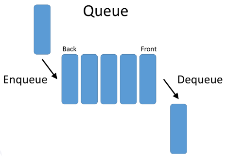

# <h1 align="center">Laporan Praktikum Modul Stack</h1>
<p align="center">Arvinanto Bahtiar</p>

## Dasar Teori
Queue (antrian) adalah struktur data yang meniru antrian orang yangsedang menunggu pelayanan misalnya di depan seorang teller bank, atau antrianorang yang sedang membeli karcis pertunjukan. Apabila diperhatikan denganseksama maka penambahan orang pada suatu antrian selalu dilakukan pada urutanpaling belakang (rear of queue), dan pelayanan selalu dilakukan pada urutandepan (front of queue) sehingga urutan proses antrian sering disebut FIFO(First In First Out). Yang pertama masuk antrian, itulah yang pertama dilayani. Ada dua cara penerapan prinsp queue, yakni dengan array dan linked list. <br/>

Berikut adalah Operasi yang digunakan pada Queue: <br/>
- Enqueue (Menambahkan elemen ke dalam Queue)
- Dequeue (Menghapus elemen dari Queue)
- Front (Mendapatkan elemen pertama dalam Queue)
- Rear (Mendapatkan elemen terakhir dalam Queue)
- IsEmpty (Memeriksa apakah Queue kosong)
- Size (Mendapatkan jumlah elemen dalam Queue)

## Guided 
```C++
#include <iostream>
using namespace std;

const int maksimalAntarian = 5;
int front = 0;
int back = 0;
string queueTeller[5];

//mengecek antrian apakah sudah penuh
bool isFULL() {
    if(back == maksimalAntarian) {
        return true;
    }
    else {
        return false;
    }
}

//mengecek antrian apakah masih kosong 
bool isEmpty() {
    if(back == 0) {
        return true;
    }
    else {
        return false;
    }
}

//menambah antrian
void tambahData(string nama) {
    if(isFULL()) {
        cout << "Antrian sudah penuh." << endl;
    }
    else {
        if(isEmpty()) {
            queueTeller[0] = nama;
            front++;
            back++;
        }
        else {
            queueTeller[back] = nama;
            back++;

        }
    }
}

//mengurangi antrian
void kurangAntrian() {
    if(isEmpty()) {
        cout << "Antrian kosong" << endl;
    }
    else {
        for(int i = 0; i < back; i++) {
            queueTeller[i] =queueTeller[i+1];
        }
        back--;
    }
}

//menghintung banyak antrian
int count() {
    return back;
}

//menghapus seluruh antrian
void clearQueue() {
    if(isEmpty()) {
        cout << "Antrian kosong" << endl;
    }
    else {
        for(int i = 0; i < back; i++) {
            queueTeller[i] = "";
        }
        back = 0;
        front = 0;
    }
}

//melihat antrian
void viewQueue() {
    cout << "Data antrian: " << endl;
    for(int i = 0; i < maksimalAntarian; i++) {
        if(queueTeller[i] != "") {
            cout << i+1 << ". " << queueTeller[i] << endl;
        }
        else {
            cout << i+1 << ". " << "(kosong)" << endl;
        }
    }
}

//main
int main() {
    enqueueAntrian("Andi");
    enqueueAntrian("Maya");
    viewQueue();
    cout << "Jumlah antrian = " << countQueue() << endl;
    dequeueAntrian();
    viewQueue();
    cout << "Jumlah antrian = " << countQueue() << endl;
    clearQueue();
    viewQueue();
    cout << "Jumlah antrian = " << countQueue() << endl;
    return 0;
}
```

### Output:

Berikut adalah contoh pengunaan queue dengan array

## Unguided 

### 1. Ubahlah penerapan konsep queue pada bagian guided dari array menjadi
linked list

```C++
#include<iostream>

using namespace std;

// Deklarasi struct node
struct node {
    string data_154;
    node *next;
};
node *front; // Deklarasi node front
node *back;  // Deklarasi node back

// Prosedur untuk menginisialisasi node front dan back sebagai NULL
void init_154(){ 
    front = NULL;
    back = NULL;
}

// Fungsi untuk memeriksa apakah antrian kosong atau tidak
bool isEmpty_154(){
    return (front == NULL);
}

// Prosedur untuk menambahkan data ke dalam antrian
void tambah_data_154(string data_154){
    node *baru = new node; // Buat node baru
    baru->data_154 = data_154; // Isi node baru dengan data
    baru->next = NULL; // Node baru tidak menunjuk ke node lain
    if(isEmpty_154()){ // Jika antrian kosong
        front = back = baru; // Node baru menjadi front dan back
    } else { // Jika antrian tidak kosong
        back->next = baru; // Tambahkan node baru di belakang antrian
        back = baru; // Node baru menjadi back
    }
}

// Prosedur untuk mengurangi antrian (menghapus node pertama)
void kurangi_antrian_154(){
    if(!isEmpty_154()){ // Jika antrian tidak kosong
        node *hapus = front; // Node hapus adalah front
        front = front->next; // Pindahkan front ke node berikutnya
        delete hapus; // Hapus node pertama
        if(front == NULL) {
            back = NULL; // Jika front kosong, set back menjadi NULL
        }
    } else {
        cout << "Antrian kosong!" << endl;
    }
}

// Fungsi untuk menghitung jumlah node dalam antrian
int Hitung_Antrian_154(){
    node *hitung = front; // Node hitung adalah front
    int jumlah_154 = 0; // Inisialisasi variabel jumlah_154
    while(hitung != NULL){ // Selama node hitung tidak NULL
        hitung = hitung->next; // Pindahkan hitung ke node berikutnya
        jumlah_154++; // Tambah nilai jumlah_154
    }
    return jumlah_154; // Kembalikan nilai jumlah_154
}

// Prosedur untuk menghapus seluruh antrian
void Hapus_Antrian_154(){
    node *hapus; // Deklarasi node hapus
    while(front != NULL){ // Selama front tidak NULL
        hapus = front; // Node hapus sama dengan front
        front = front->next; // Pindahkan front ke node berikutnya
        delete hapus; // Hapus node yang dihapus
    }
    back = NULL; // Set back menjadi NULL
}

// Prosedur untuk menampilkan antrian
void Melihat_Antrian_154(){
    if(isEmpty_154()){ // Jika antrian kosong
        cout << "Antrian kosong!" << endl;
    } else { // Jika antrian tidak kosong
        cout << "--- Antrian Saat Ini ---" << endl;
        node *bantu = front; // Node bantu adalah front
        int nomor_antrian_154 = 1; // Inisialisasi variabel nomor_antrian_154 dengan nilai 1
        while(bantu != NULL){ // Selama node bantu tidak NULL
            cout << nomor_antrian_154 << ". " << bantu->data_154 << endl; // Tampilkan nomor antrian dan data
            bantu = bantu->next; // Pindahkan bantu ke node berikutnya
            nomor_antrian_154++; // Tambah nomor antrian
        }
    }
    cout << endl;
}

int main(){
    string data_154; 
    int pilih_154; 
    char yakin_154;

    init_154(); // Inisialisasi antrian

    MenuUtama:
    cout << "==== Program Queue Naufal Geraldo ====" << endl;
    cout << "==== Menu Program ====" << endl; // Tampilan menu antrian
    cout << "1. Tambah antrian" << endl;
    cout << "2. Kurangi antrian" << endl;
    cout << "3. Hitung jumlah antrian" << endl;
    cout << "4. Hapus antrian" << endl;
    cout << "5. Lihat antrian" << endl;
    cout << "6. Keluar" << endl;
    cout << "Pilihan Anda [1-6] = ";
    cin >> pilih_154;
    cout << endl;

    switch(pilih_154){ // Switch case berdasarkan pilihan user
        case 1: // Jika user memilih 1, tampilkan menu tambah antrian
            cout << "==== Tambah Antrian ====" << endl;
            cout << "Masukkan data = ";
            cin >> data_154;
            tambah_data_154(data_154); // Panggil prosedur tambah_data_154 dengan parameter data
            cout << "Data telah tersimpan!" << endl;
            cout << endl;
            goto MenuUtama;
            break;
        case 2: // Jika user memilih 2, tampilkan menu kurangi antrian
            cout << "==== Kurangi Antrian ====" << endl;
            if(isEmpty_154()){ // Jika antrian kosong, tampilkan "Antrian masih kosong!"
                cout << "Antrian masih kosong!" << endl;
            } else { // Jika antrian tidak kosong
                cout << "Apakah anda ingin mengurangi antrian (menghapus antrian pertama)? [y/n] = "; // Validasi keyakinan user untuk mengurangi antrian
                cin >> yakin_154;
                if(yakin_154 == 'y' || yakin_154 == 'Y'){ // Jika user memilih y atau Y
                    kurangi_antrian_154(); // Panggil prosedur kurangi_antrian_154()
                    cout << "Antrian telah dikurangi" << endl;
                } else if(yakin_154 == 'n' || yakin_154 == 'N'){ // Jika user memilih n atau N
                    cout << "Aksi dibatalkan" << endl;
                }
            }
            cout << endl;
            goto MenuUtama;
            break;
        case 3: // Jika user memilih 3, tampilkan menu Hitung Jumlah Antrian
            cout << "==== Hitung Jumlah Antrian ====" << endl;
            cout << "Antrian yang tersimpan saat ini sebanyak " << Hitung_Antrian_154() << endl; // Panggil fungsi Hitung_Antrian_154()
            cout << endl;
            goto MenuUtama;
            break;
        case 4: // Jika user memilih 4, tampilkan menu hapus antrian
            cout << "==== Hapus Antrian ====" << endl;
            cout << "Apakah Anda yakin untuk menghapus seluruh antrian? [y/n] = "; // Validasi keyakinan user untuk menghapus seluruh antrian
            cin >> yakin_154;
            if(yakin_154 == 'y' || yakin_154 == 'Y'){ // Jika user memilih y atau Y
                Hapus_Antrian_154(); // Panggil prosedur Hapus_Antrian_154()
                cout << "Antrian telah dihapus" << endl;
            } else if(yakin_154 == 'n' || yakin_154 == 'N'){ // Jika user memilih n atau N
                cout << "Aksi dibatalkan" << endl;
            }
            cout << endl;
            goto MenuUtama;
            break;
        case 5: // Jika user memilih 5, tampilkan antrian
            Melihat_Antrian_154(); // Panggil prosedur Melihat_Antrian_154()
            cout << endl;
            goto MenuUtama;
            break;
        case 6: // Jika user memilih 6, keluar dari program
            cout << "Anda keluar dari program" << endl;
            cout << endl;
            return 0;
            break;
        default: // Jika user memilih selain 1-6, tampilkan "Pilihan yang anda masukkan salah!"
            cout << "Pilihan yang anda masukkan salah!" << endl;
            cout << endl;
            goto MenuUtama;
            break;
    }
}
```

#### Output:
_2311102154_Naufal Geraldo Putra Pramudianartono.png>)

- Deklarasi Struct node:
  1. struct node mendefinisikan struktur node yang berisi data_154, yaitu data string, dan pointer next yang menunjuk ke node berikutnya.
  2. front dan back adalah pointer yang menunjuk ke node pertama dan terakhir dalam antrian.

- Inisialisasi Antrian:
  Prosedur init_154() menginisialisasi front dan back menjadi NULL, menandakan bahwa antrian kosong.


- Pemeriksaan Antrian Kosong:
  Fungsi isEmpty_154() mengembalikan true jika front adalah NULL, menandakan antrian kosong, dan false jika tidak.


- Menambah Data ke Antrian:
  1. Prosedur tambah_data_154() menambahkan node baru ke antrian. Node baru dibuat dan diisi dengan data string.
  2. Jika antrian kosong, node baru menjadi front dan back.
  3. Jika antrian tidak kosong, node baru ditambahkan di belakang antrian, dan back diperbarui untuk menunjuk ke node baru.

- Menghapus Node Pertama dari Antrian:
  1. Prosedur kurangi_antrian_154() menghapus node pertama dari antrian.
  2. Jika antrian tidak kosong, node pertama dihapus dan front diperbarui untuk menunjuk ke node berikutnya.
  3. Jika antrian hanya memiliki satu node, front dan back diatur menjadi NULL.

- Menghitung Jumlah Node dalam Antrian:
  Fungsi Hitung_Antrian_154() menghitung jumlah node dalam antrian dengan iterasi melalui node dari front ke back.

- Menghapus Seluruh Antrian:
  1. Prosedur Hapus_Antrian_154() menghapus seluruh node dalam antrian dengan iterasi melalui setiap node dan menghapusnya.
  2. Setelah semua node dihapus, front dan back diatur menjadi NULL.

- Menampilkan Isi Antrian:
  1. Prosedur Melihat_Antrian_154() menampilkan isi antrian.
  2. Jika antrian kosong, menampilkan pesan "Antrian kosong!".
  3. Jika tidak, iterasi melalui setiap node dan menampilkan data.

- Fungsi Main:
  1. main() adalah menu utama program yang menyediakan opsi untuk menambahkan antrian, mengurangi antrian, menghitung jumlah antrian, menghapus antrian, melihat antrian, dan keluar dari program.
  2. Pengguna diminta untuk memilih opsi dan sesuai pilihan, operasi terkait dilakukan menggunakan prosedur atau fungsi yang sudah dijelaskan di atas.
  3. Program kembali ke menu utama setelah setiap operasi, kecuali jika pengguna memilih untuk keluar.

### 2. Dari nomor 1 buatlah konsep antri dengan atribut Nama mahasiswa dan NIM
Mahasiswa
```C++
#include<iostream>

using namespace std;

// Deklarasi struct node
struct node { // Node berisi variabel nama, nim, dan pointer next
    string nama_154;
    string nim_154;
    node *next;
};
    node *front; // Deklarasi node front
    node *back; // Deklarasi node back

// Prosedur untuk menginisialisasi node front dan back sebagai NULL
void init_154(){ 
    front = NULL;
    back = NULL;
}

// Fungsi untuk memeriksa apakah antrian kosong atau tidak
bool isEmpty_154(){
    if (front == 0){
        return true; // Jika tidak ada node pertama, maka antrian kosong (kembalikan true)
    } else {
        return false; // Jika ada node pertama, maka antrian tidak kosong (kembalikan false)
    }
}

// Prosedur untuk menambahkan data ke dalam antrian
void tambah_data_154(string nama_154, string nim_154){
    node *baru = new node; // Buat node baru
    baru->nama_154 = nama_154; // Isi node baru dengan nama mahasiswa dan NIM
    baru->nim_154 = nim_154; 
    baru->next = NULL; // Node baru tidak menunjuk ke node lain
    if(isEmpty_154() == true){ // Jika antrian kosong
        front = back = baru; // Node baru menjadi front dan back
        back->next = NULL; // Node berikutnya dari back adalah NULL
    } else if(isEmpty_154() == false){ // Jika antrian tidak kosong
        back->next = baru; // Tambahkan node baru di belakang antrian
        back = baru; // Node baru menjadi back
    }
}

// Prosedur untuk mengurangi antrian (menghapus node pertama)
void kurangi_antrian_154(){
    node *hapus; // Deklarasi node hapus
    if(isEmpty_154() == false){ // Jika antrian tidak kosong
        if(front->next != NULL){ // Jika ada node setelah front
            hapus = front; // Node hapus adalah front
            front = front->next; // Pindahkan front ke node berikutnya
            delete hapus; // Hapus node pertama
        } else { // Jika tidak ada node setelah front
            front = back = NULL; // Front dan back menjadi NULL
        }
    }
}

// Fungsi untuk menghitung jumlah node dalam antrian
int Hitung_Antrian_154(){
    node *hitung; // Deklarasi node hitung
    hitung = front; // Node hitung adalah front
    int jumlah_154 = 0; // Inisialisasi variabel jumlah_154
    while(hitung != NULL){ // Selama node hitung tidak NULL
        hitung = hitung->next; // Pindahkan hitung ke node berikutnya
        jumlah_154++; // Tambah nilai jumlah_154
    }
    return jumlah_154; // Kembalikan nilai jumlah_154
}

// Prosedur untuk menghapus seluruh antrian
void Hapus_Antrian_154(){
    node *hapus, *bantu; // Deklarasi node hapus dan bantu
    bantu = front; // Node bantu adalah front
    while(bantu != NULL){ // Selama node bantu tidak NULL
        hapus = bantu; // Node hapus sama dengan node bantu
        bantu = bantu->next; // Pindahkan bantu ke node berikutnya
        delete hapus; // Hapus node yang dihapus
    }
    front = back = NULL; // Front dan back menjadi NULL
}

// Prosedur untuk menampilkan antrian
void Melihat_Antrian_154(){
    node *bantu; // Deklarasi node bantu
    bantu = front; // Node bantu adalah front
    if(isEmpty_154() == true){ // Jika antrian kosong
        cout << "Antrian kosong!" << endl; 
    } else if(isEmpty_154() == false){ // Jika antrian tidak kosong
        cout << "--- Antrian Saat Ini ---" << endl; 
        int nomor_antrian_154 = 1; // Inisialisasi variabel nomor_antrian_154 dengan nilai 1
        while(bantu != NULL){ // Selama node bantu tidak NULL
            cout << nomor_antrian_154 << ". " << bantu->nama_154 << " - " << bantu->nim_154 << endl; // Tampilkan nomor antrian, nama, dan NIM
            bantu = bantu->next; // Pindahkan bantu ke node berikutnya
            nomor_antrian_154++; // Tambah nomor antrian
        }
    }
    cout << endl;
}

int main(){
    string nama_154, nim_154; 
    int pilih_154; 
    char yakin_154;
    MenuUtama:
    cout << "==== Program Queue Naufal Geraldo ====" << endl;
    cout << "==== Menu Program ====" << endl; // Tampilan menu antrian mahasiswa
    cout << "1. Tambah antrian" << endl;
    cout << "2. Kurangi antrian" << endl;
    cout << "3. Hitung jumlah antrian" << endl;
    cout << "4. Hapus antrian" << endl;
    cout << "5. Lihat antrian" << endl;
    cout << "6. Keluar" << endl;
    cout << "Pilihan Anda [1-6] = ";
    cin >> pilih_154;
    cout << endl;
    switch(pilih_154){ // Switch case berdasarkan pilihan user
        case 1: // Jika user memilih 1, tampilkan menu tambah antrian
            cout << "==== Tambah Antrian ====" << endl;
            cout << "Masukkan nama mahasiswa = ";
            cin >> nama_154;
            cout << "Masukkan NIM mahasiswa = ";
            cin >> nim_154;
            tambah_data_154(nama_154, nim_154); // Panggil prosedur tambah_data_154 dengan parameter nama dan NIM
            cout << "Data mahasiswa telah tersimpan!" << endl;
            cout << endl;
            goto MenuUtama;
            break;
        case 2: // Jika user memilih 2, tampilkan menu kurangi antrian
            cout << "==== Kurangi Antrian ====" << endl;
            if(isEmpty_154() == true){ // Jika antrian kosong, tampilkan "Antrian masih kosong!"
                cout << "Antrian masih kosong!" << endl;
            } else { // Jika antrian tidak kosong
                cout << "Apakah anda ingin mengurangi antrian (menghapus antrian pertama)? [y/n] = "; // Validasi keyakinan user untuk mengurangi antrian
                cin >> yakin_154;
                if(yakin_154 == 'y' || yakin_154 == 'Y'){ // Jika user memilih y atau Y
                    kurangi_antrian_154(); // Panggil prosedur kurangi_antrian_154()
                    cout << "Antrian telah dikurangi" << endl;
                } else if(yakin_154 == 'n' || yakin_154 == 'N'){ // Jika user memilih n atau N
                    cout << "Aksi dibatalkan" << endl;
                }
            }
            cout << endl;
            goto MenuUtama;
            break;
        case 3: // Jika user memilih 3, tampilkan menu Hitung Jumlah Antrian
            cout << "==== Hitung Jumlah Antrian ====" << endl;
            cout << "Antrian yang tersimpan saat ini sebanyak " << Hitung_Antrian_154() << endl; // Panggil fungsi Hitung_Antrian_154()
            cout << endl;
            goto MenuUtama;
            break;
        case 4: // Jika user memilih 4, tampilkan menu hapus antrian
            cout << "==== Hapus Antrian ====" << endl;
            cout << "Apakah Anda yakin untuk menghapus seluruh antrian? [y/n] = "; // Validasi keyakinan user untuk menghapus seluruh antrian
            cin >> yakin_154;
            if(yakin_154 == 'y' || yakin_154 == 'Y'){ // Jika user memilih y atau Y
                Hapus_Antrian_154(); // Panggil prosedur Hapus_Antrian_154()
                cout << "Antrian telah dihapus" << endl;
            } else if(yakin_154 == 'n' || yakin_154 == 'N'){ // Jika user memilih n atau N
                cout << "Aksi dibatalkan" << endl;
            }
            cout << endl;
            goto MenuUtama;
            break;
        case 5: // Jika user memilih 5, tampilkan antrian
            Melihat_Antrian_154(); // Panggil prosedur Melihat_Antrian_154()
            cout << endl;
            goto MenuUtama;
            break;
        case 6:
            cout << "Anda keluar dari program" << endl;
            cout << endl;
            return 0;
            break;
        default: // Jika user memilih selain 1-5, tampilkan "Pilihan yang anda masukkan salah!"
            cout << "Pilihan yang anda masukkan salah!" << endl;
            cout << endl;
            goto MenuUtama;
            break;
    }
}
```

#### Output:
_2311102154_Naufal Geraldo Putra Pramudianartono.png>)

- Deklarasi Struct node:
  1. struct node mendefinisikan struktur node yang berisi nama_154, nim_154, dan pointer next yang menunjuk ke node berikutnya.
  2. front dan back adalah pointer yang menunjuk ke node pertama dan terakhir dalam antrian.

- Inisialisasi Antrian:
  Prosedur init_154() menginisialisasi front dan back menjadi NULL, menandakan bahwa antrian kosong.

- Pemeriksaan Antrian Kosong:
  Fungsi isEmpty_154() mengembalikan true jika front adalah NULL, menandakan antrian kosong, dan false jika tidak.

- Menambah Data ke Antrian:
  1. Prosedur tambah_data_154() menambahkan node baru ke antrian. Node baru dibuat dan diisi dengan nama dan NIM mahasiswa.
  2. Jika antrian kosong, node baru menjadi front dan back.
  3. Jika antrian tidak kosong, node baru ditambahkan di belakang antrian, dan back diperbarui untuk menunjuk ke node baru.

- Menghapus Node Pertama dari Antrian:
  1. Prosedur kurangi_antrian_154() menghapus node pertama dari antrian.
  2. Jika antrian tidak kosong, node pertama dihapus dan front diperbarui untuk menunjuk ke node berikutnya.
  3. Jika antrian hanya memiliki satu node, front dan back diatur menjadi NULL.

- Menghitung Jumlah Node dalam Antrian:
  Fungsi Hitung_Antrian_154() menghitung jumlah node dalam antrian dengan iterasi melalui node dari front ke back.

- Menghapus Seluruh Antrian:
  1. Prosedur Hapus_Antrian_154() menghapus seluruh node dalam antrian dengan iterasi melalui setiap node dan menghapusnya.
  2. Setelah semua node dihapus, front dan back diatur menjadi NULL.

- Menampilkan Isi Antrian:
  1. Prosedur Melihat_Antrian_154() menampilkan isi antrian.
  2. Jika antrian kosong, menampilkan pesan "Antrian kosong!".
  3. Jika tidak, iterasi melalui setiap node dan menampilkan nama dan NIM mahasiswa.

- Fungsi Main:
  1. Fungsi main() adalah menu utama program yang menyediakan opsi untuk menambahkan antrian, mengurangi antrian, menghitung jumlah antrian, menghapus antrian, melihat antrian, dan keluar dari program.
  2. Pengguna diminta untuk memilih opsi dan sesuai pilihan, operasi terkait dilakukan menggunakan prosedur atau fungsi yang sudah dijelaskan di atas.
  3. Program kembali

## Kesimpulan
Queue atau antrian adalah list linier dimana urutan proses antrian dilakukan secara FIFO (First In First Out) atau yang pertama masuk antrian, itulah yang pertama dilayani. yang dapat diimplementasikan dengan menggunakan array atau linked list dan memiliki operasi utama yang meliputi: Enqueue, Dequeue, Front, Rear, IsEmpty, Size.

## Referensi
[1] Triase, ST, M. Kom. "Struktur Data: Diktat Edisi Revisi." (2020).<br/>
[2] Fendyanto. "Laporan Praktikum Struktur Data Materi: Implementasi Stack dan Queue." (2020).<br/>