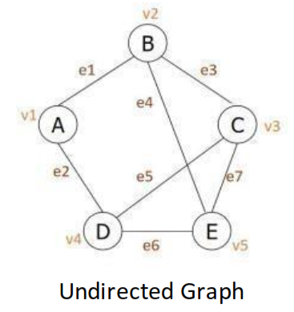
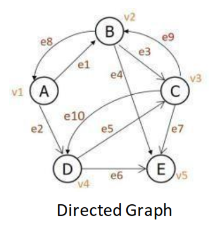
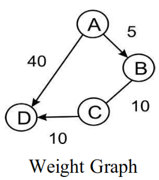
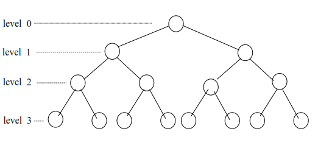
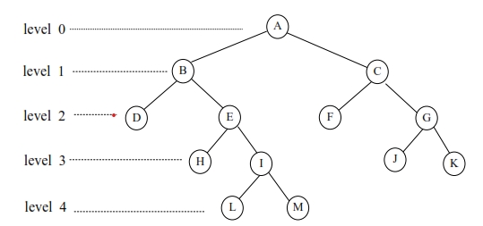
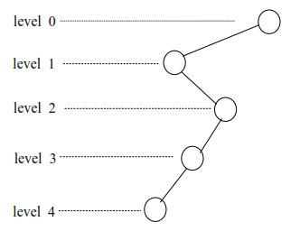
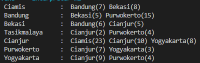
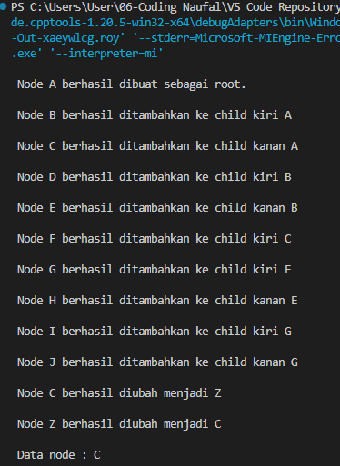
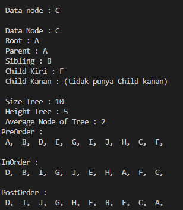

# <h1 align="center">Laporan Praktikum Modul Graf dan Tree</h1>
<p align="center">Naufal Geraldo Putra Pramudianartono - 2311102154</p>

## Dasar Teori

### Graf
Graf adalah kumpulan noktah (simpul) di dalam bidang dua dimensi yang dihubungkan dengan sekumpulan garis (sisi). Graph dapat digunakan untuk merepresentasikan objek-objek diskrit dan hubungan antara objek-objek tersebut. Representasi visual dari graph adalah dengan menyatakan objek sebagai noktah, bulatan atau titik (Vertex), sedangkan hubungan antara objek dinyatakan dengan garis (Edge).

#### Jenis-jenis Graf
1.  Graph tak berarah (undirected graph atau non-directed graph):
 <br/>
Urutan simpul dalam sebuah busur tidak dipentingkan. Misal busur e1
dapat disebut busur AB atau BA 

2.  Graph berarah (directed graph): 
 <br/>
Urutan simpul mempunyai arti. Misal busur AB adalah e1 sedangkan
busur BA adalah e8.  

3.  Graph Berbobot (Weighted Graph):
 <br/>
- Jika setiap busur mempunyai nilai yang menyatakan hubungan 
antara 2 buah simpul, maka busur tersebut dinyatakan memiliki
bobot. 
- Bobot sebuah busur dapat menyatakan panjang sebuah jalan dari 2 buah titik, jumlah rata-rata kendaraan perhari yang melalui sebuah jalan, dll. 


### Tree
Tree dalam pemrograman merupakan struktur data yang tidak linear / non linear yang digunakan terutama untuk merepresentasikan hubungan data yang bersifat hierarkis antara elemen-elemennya. Kumpulan elemen yang salah satu elemennya disebut dengan root (akar) dan sisa elemen yang lain disebut sebagai simpul (node/vertex) yang terpecah menjadi sejumlah himpunan yang tidak saling berhubungan satu sama lain, yang disebut subtree / cabang.

#### Jenis-jenis Binary Tree
Binary Tree, adalah tree dengan node yang memiliki jumlah anak maksimum  2. Berikut adalah semua jenisnya:
1. Full Binary Tree:

Binary Tree yang tiap nodenya (kecuali leaf) memiliki dua 
child/anak  dan  setiap sub tree harus mempunyai panjang path yang sama (leaf berada pada level yang sama).

2. Complete Binary Tree:

Binary Tree yang tiap nodenya (kecuali leaf) memiliki dua
child/anak,  tetapi leaf  dapat  berada pada level yang berbeda.

3. Skewed Binary Tree: 

Binary Tree yang tiap nodenya (kecuali leaf) hanya memiliki 
satu child/anak.


#### Operasi Tree
Operasi-operasi pada binary Tree : 
1. Create <br/> 
   Procedure Create berguna untuk menciptakan BTree baru dan Kosong. 
2. Empty <br/> 
   Function Empty adalah untuk memeriksa apakah Btree masih kosong. 
3. Insert <br/>  
   Adalah prosedur untuk menyisipkan node baru kedalam Tree.  Terdapat 3 pilihan yang mungkin : insert sebagai root  (jika dan hanya jika Btree Empty), sebagai Left Child/Anak Kiri, dan sebagai Right Child / Anak Kanan 
4. Find <br/> 
   Mencari data tertentu pada Tree, merupakan pemanfaatan Traverse 
5. Update <br/> 
   Mengubah isi dari node yang ditunjuk oleh Current  (Current adalah variabel pointer yang dideklarasikan untuk digunakan dalam penelusuran pohon) 
6. Retrieve <br/> 
   Mengetahui isi dari node yang ditunjuk oleh current  
7. DeleteSub <br/> 
   Menghapus sebuah subtree yang ditunjuk oleh current (node beserta seluruh
descentdantnya) 
8. Clear <br/> 
   Procedure Clear berguna untuk mengosongkan Btree yang sudah ada. Operasi pengosongan dilakukan dengan cara menghapus seluruh node yang dimulai dari node leaf. Untuk menghindarkan kerumitan logika, maka dilakukan pemanggilan rekursif terhadap Procedure DeleteSub. 
9. Characteristic <br/>
   Digunakan untuk mengetahui karakteristik dari suatu tree. Yakni size, height, serta average lenght-nya.
10. Traverse <br/>
    Digunakan untuk mengunjungi seluruh node-node pada tree dengan cara traversal. Terdapat 3 metode traversal yang dibahas dalam modul ini yakni Pre-Order, In-Order, dan Post-Order 
    - Pre-Order <br/>
    Penelusuran secara pre-order memiliki alur: 
    a. Cetak data pada simpul root <br/>
    b. Secara rekursif mencetak seluruh data pada subpohon kiri <br/>
    c. Secara rekursif mencetak seluruh data pada subpohon kanan <br/>
    - In-Order <br/>
    Penelusuran secara in-order memiliki alur:
    a. Secara rekursif mencetak seluruh data pada subpohon kiri <br/>
    b. Cetak data pada root <br/>
    c. Secara rekursif mencetak seluruh data pada subpohon kanan <br/>
    - Post Order <br/>
    Penelusuran secara in-order memiliki alur: 
    a. Secara rekursif mencetak seluruh data pada subpohon kiri <br/>
    b. Secara rekursif mencetak seluruh data pada subpohon kanan <br/>
    c. Cetak data pada root <br/>

## Guided 

### 1. Program Graph
```C++
#include <iostream>
#include <iomanip>

using namespace std;

string simpul[7] = {"Ciamis", "Bandung", "Bekasi", "Tasikmalaya", "Cianjur", "Purwokerto", "Yogyakarta"};

int busur[7][7] = {
    {0, 7, 8, 0, 0, 0, 0},
    {0, 0, 5, 0, 0, 15, 0},
    {0, 6, 0, 0, 5, 0, 0},
    {0, 0, 0, 0, 2, 4, 0},
    {23, 0, 0, 0, 10, 0, 8},
    {0, 0, 0, 0, 7, 0, 3},
    {0, 0, 0, 0, 9, 4, 0}
};

void tampilGraph() {
    for(int baris = 0; baris < 7; baris++) {
        cout << " " << setiosflags(ios::left) << setw(15) << simpul[baris] << " : ";
        for(int kolom = 0; kolom < 7; kolom++) {
            if(busur[baris][kolom] != 0) {
                cout << " " << simpul[kolom] << "(" << busur [baris] [kolom] << ")"; 
            }
        } cout << endl;
    }
}

int main() {
    tampilGraph();
    return 0;
}
```

#### Output:

Kode di atas adalah program C++ yang menampilkan representasi graf berarah (directed graph) dengan simpul (nodes) dan busur (edges) menggunakan matriks ketetanggaan (adjacency matrix). 
- Deklarasi
  1. Simpul adalah array dari string yang menyimpan nama-nama simpul (kota) dalam graf. Ada 7 simpul dalam graf ini.
  2. busur adalah matriks ketetanggaan (adjacency matrix) 7x7 yang menyimpan bobot dari busur antara simpul-simpul. Nilai 0 berarti tidak ada busur antara dua simpul tersebut.
- Fungsi tampilGraph()
  1. Fungsi tampilGraph digunakan untuk menampilkan graf dalam bentuk teks yang mudah dibaca.
  2. Loop luar for iterasi baris dari 0 sampai 6 untuk mengakses setiap simpul dalam simpul.
  3. cout dengan setiosflags(ios::left) dan setw(15) digunakan untuk mencetak nama simpul dengan rata kiri dan lebar tetap 15 karakter.
  4. Loop dalam for iterasi kolom dari 0 sampai 6 untuk memeriksa busur yang keluar dari simpul saat ini (baris).
  5. Jika busur[baris][kolom] tidak sama dengan 0, maka ada busur dari simpul baris ke simpul kolom, dan informasi ini dicetak dalam format nama_simpul_tujuan(bobot_busur).
- main()
  main memanggil fungsi tampilGraph agar graf dapat di tampilkan

### 2. Program Tree
```C++
#include <iostream>
#include <iomanip>
    using namespace std;
struct Pohon{
    char data;
    Pohon *left, *right, *parent;
};
Pohon *root, *baru;
void init(){
    root = NULL;
}
bool isEmpty(){
    return root == NULL;
}
void buatNode(char data){
    if (isEmpty())
    {
        root = new Pohon();
        root->data = data;
        root->left = NULL;
        root->right = NULL;
        root->parent = NULL;
        cout << "\n Node " << data << " berhasil dibuat sebagai root."
             << endl;
    }
    else
    {
        cout << "\n Tree sudah ada!" << endl;
    }
}
Pohon *insertLeft(char data, Pohon *node)
{
    if (isEmpty())
    {
        cout << "\n Buat tree terlebih dahulu!" << endl;
        return NULL;
    }
    else
    {
        if (node->left != NULL)
        {
            cout << "\n Node " << node->data << " sudah ada child kiri !" << endl;
                return NULL;
        }
        else
        {
            Pohon *baru = new Pohon();
            baru->data = data;
            baru->left = NULL;
            baru->right = NULL;
            baru->parent = node;
            node->left = baru;
            cout << "\n Node " << data << " berhasil ditambahkan ke child kiri " << baru->parent->data << endl;
                return baru;
        }
    }
}
Pohon *insertRight(char data, Pohon *node)
{
    if (isEmpty())
    {
        cout << "\n Buat tree terlebih dahulu!" << endl;
        return NULL;
    }
    else
    {
        if (node->right != NULL)
        {
            cout << "\n Node " << node->data << " sudah ada child kanan !" << endl;
                return NULL;
        }
        else
        {
            Pohon *baru = new Pohon();
            baru->data = data;
            baru->left = NULL;
            baru->right = NULL;
            baru->parent = node;
            node->right = baru;
            cout << "\n Node " << data << " berhasil ditambahkan ke child kanan " << baru->parent->data << endl;
                return baru;
        }
    }
}
void update(char data, Pohon *node)
{
    if (isEmpty())
    {
        cout << "\n Buat tree terlebih dahulu!" << endl;
    }
    else
    {
        if (!node)
        {
            cout << "\n Node yang ingin diganti tidak ada!!" << endl;
        }
        else
        {
            char temp = node->data;
            node->data = data;
            cout << "\n Node " << temp << " berhasil diubah menjadi "
                 << data << endl;
        }
    }
}
void retrieve(Pohon *node)
{
    if (isEmpty())
    {
        cout << "\n Buat tree terlebih dahulu!" << endl;
    }
    else
    {
        if (!node)
        {
            cout << "\n Node yang ditunjuk tidak ada!" << endl;
        }
        else
        {
            cout << "\n Data node : " << node->data << endl;
        }
    }
}
void find(Pohon *node)
{
    if (isEmpty())
    {
        cout << "\n Buat tree terlebih dahulu!" << endl;
    }
    else
    {
        if (!node)
        {
            cout << "\n Node yang ditunjuk tidak ada!" << endl;
        }
        else
        {
            cout << "\n Data Node : " << node->data << endl;
            cout << " Root : " << root->data << endl;
            if (!node->parent)
                cout << " Parent : (tidak punya parent)" << endl;
            else
                cout << " Parent : " << node->parent->data << endl;
            if (node->parent != NULL && node->parent->left != node &&
                node->parent->right == node)
                cout << " Sibling : " << node->parent->left->data << endl;
            else if (node->parent != NULL && node->parent->right != node && node->parent->left == node)
                cout << " Sibling : " << node->parent->right->data << endl;
            else
                cout << " Sibling : (tidak punya sibling)" << endl;
            if (!node->left)
                cout << " Child Kiri : (tidak punya Child kiri)" << endl;
            else
                cout << " Child Kiri : " << node->left->data << endl;
            if (!node->right)
                cout << " Child Kanan : (tidak punya Child kanan)" << endl;
            else
                cout << " Child Kanan : " << node->right->data << endl;
        }
    }
}
// Penelusuran (Traversal)
// preOrder
void preOrder(Pohon *node = root)
{
    if (isEmpty())
    {
        cout << "\n Buat tree terlebih dahulu!" << endl;
    }
    else
    {
        if (node != NULL)
        {
            cout << " " << node->data << ", ";
            preOrder(node->left);
            preOrder(node->right);
        }
    }
}
// inOrder
void inOrder(Pohon *node = root)
{
    if (isEmpty())
    {
        cout << "\n Buat tree terlebih dahulu!" << endl;
    }
    else
    {
        if (node != NULL)
        {
            inOrder(node->left);
            cout << " " << node->data << ", ";
            inOrder(node->right);
        }
    }
}
// postOrder
void postOrder(Pohon *node = root)
{
    if (isEmpty())
    {
        cout << "\n Buat tree terlebih dahulu!" << endl;
    }
    else
    {
        if (node != NULL)
        {
            postOrder(node->left);
            postOrder(node->right);
            cout << " " << node->data << ", ";
        }
    }
}
// Hapus Node Tree
void deleteTree(Pohon *node)
{
    if (isEmpty())
    {
        cout << "\n Buat tree terlebih dahulu!" << endl;
    }
    else
    {
        if (node != NULL)
        {
            if (node != root)
            {
                node->parent->left = NULL;
                node->parent->right = NULL;
            }
            deleteTree(node->left);
            deleteTree(node->right);
            if (node == root)
            {
                delete root;
                root = NULL;
            }
            else
            {
                delete node;
            }
        }
    }
}
// Hapus SubTree
void deleteSub(Pohon *node)
{
    if (isEmpty())
    {
        cout << "\n Buat tree terlebih dahulu!" << endl;
    }
    else
    {
        deleteTree(node->left);
        deleteTree(node->right);
        cout << "\n Node subtree " << node->data << " berhasil dihapus." << endl;
    }
}
// Hapus Tree
void clear()
{
    if (isEmpty())
    {
        cout << "\n Buat tree terlebih dahulu!!" << endl;
    }
    else
    {
        deleteTree(root);
        cout << "\n Pohon berhasil dihapus." << endl;
    }
}
// Cek Size Tree
int size(Pohon *node = root)
{
    if (isEmpty())
    {
        cout << "\n Buat tree terlebih dahulu!!" << endl;
        return 0;
    }
    else
    {
        if (!node)
        {
            return 0;
        }
        else
        {
            return 1 + size(node->left) + size(node->right);
        }
    }
}
// Cek Height Level Tree
int height(Pohon *node = root)
{
    if (isEmpty())
    {
        cout << "\n Buat tree terlebih dahulu!" << endl;
        return 0;
    }
    else
    {
        if (!node)
        {
            return 0;
        }
        else
        {
            int heightKiri = height(node->left);
            int heightKanan = height(node->right);
            if (heightKiri >= heightKanan)
            {
                return heightKiri + 1;
            }
            else
            {
                return heightKanan + 1;
            }
        }
    }
}
// Karakteristik Tree
void characteristic()
{
    cout << "\n Size Tree : " << size() << endl;
    cout << " Height Tree : " << height() << endl;
    cout << " Average Node of Tree : " << size() / height() << endl;
}
int main()
{
    buatNode('A');
    Pohon *nodeB, *nodeC, *nodeD, *nodeE, *nodeF, *nodeG, *nodeH, *nodeI, *nodeJ;

    nodeB = insertLeft('B', root),
    nodeC =  insertRight('C', root),
    nodeD = insertLeft('D', nodeB), 
    nodeE = insertRight('E', nodeB), 
    nodeF = insertLeft('F', nodeC), 
    nodeG = insertLeft('G', nodeE), 
    nodeH = insertRight('H', nodeE),
    nodeI = insertLeft('I', nodeG), 
    nodeJ = insertRight('J', nodeG);

    update('Z', nodeC);
    update('C', nodeC);

    retrieve(nodeC);

    find(nodeC);

    characteristic();

    cout << "PreOrder : " << endl;
    preOrder(root);
    cout << "\n" << endl;

    cout << "InOrder : " << endl;
    inOrder(root);
    cout << "\n" << endl;

    cout << "PostOrder : " << endl;
    postOrder(root);
    cout << "\n" << endl;

    return 0;
}
```

#### Output:


Kode di atas adalah program C++ yang mengimplementasikan berbagai operasi pada struktur data pohon biner (binary tree). Operasi-operasi tersebut mencakup pembuatan node, penyisipan node ke kiri dan kanan, pengubahan nilai node, penelusuran pohon (pre-order, in-order, dan post-order), serta operasi karakteristik seperti ukuran dan tinggi pohon.
- Deklarasi
  1. Pohon adalah struktur yang mendefinisikan node dalam pohon biner, dengan data karakter (data), pointer ke anak kiri (left), anak kanan (right), dan parent (parent).
  2. root dan baru adalah pointer yang menunjuk ke node dalam pohon.
- init() <br/>
  init menginisialisasi pohon dengan mengatur root menjadi NULL.
- isEmpty() <br/>
  isEmpty mengembalikan true jika root adalah NULL, menunjukkan bahwa pohon kosong.
- buatNode(char data) <br/>
  buatNode membuat node root jika pohon kosong. Jika pohon sudah ada, menampilkan pesan bahwa pohon sudah ada.
- insertLeft(char data, Pohon *node) <br/>
  insertLeft menyisipkan node baru ke kiri node yang diberikan (node). Jika node sudah memiliki anak kiri, menampilkan pesan kesalahan. Jika tidak, menambahkan node baru sebagai anak kiri.
- insertRight(char data, Pohon *node) <br/>
  insertRight menyisipkan node baru ke kanan node yang diberikan (node). Jika node sudah memiliki anak kanan, menampilkan pesan kesalahan. Jika tidak, menambahkan node baru sebagai anak kanan.
- update(char data, Pohon *node) <br/>
  update mengubah nilai data dari node yang diberikan (node). Jika node tidak ada, menampilkan pesan kesalahan.
- retrieve(Pohon *node) <br/>
  retrieve menampilkan data dari node yang diberikan (node). Jika node tidak ada, menampilkan pesan kesalahan.
- find(Pohon *node) <br/>
  find menampilkan informasi lengkap dari node yang diberikan (node), termasuk root, parent, sibling, dan anak-anaknya.
- Traversal
  1. preOrder menelusuri pohon dalam urutan pre-order (root, left, right).
  2. inOrder menelusuri pohon dalam urutan in-order (left, root, right).
  3. postOrder menelusuri pohon dalam urutan post-order (left, right, root).
- Penghapus
  1. deleteTree menghapus node dan seluruh subtree dari node tersebut.
  2. eleteSub menghapus subtree dari node yang diberikan (node).
  3. clear menghapus seluruh pohon.
- charakteristic() <br/>
  characteristic menampilkan ukuran, tinggi, dan rata-rata node dalam pohon
  1. size menghitung jumlah node dalam pohon
  2. height menghitung tinggi pohon
- main() <br/>
  Fungsi main menguji berbagai operasi pada pohon biner, seperti membuat node, menyisipkan node, memperbarui node, mengambil data, menemukan informasi node, dan menelusuri pohon. Pada akhirnya, menampilkan karakteristik pohon dan hasil penelusuran (pre-order, in-order, dan post-order).


## Unguided 

### 1. Buatlah program graph dengan menggunakan inputan user untuk menghitung jarak dari sebuah kota ke kota lainnya

```C++

```

#### Output:
_2311102154_Naufal Geraldo Putra Pramudianartono.png>)
Program ini mengimplementasikan input dan output jarak antar kota dalam bentuk matriks, dan memberikan tampilan yang terformat dengan baik menggunakan vector dan iomanip. Pengguna dapat memasukkan sejumlah kota, memberikan jarak antar kota, dan program akan menampilkan matriks jarak dengan nama-nama kota sebagai header baris dan kolom.
- Input simpul dan nama kota
  1. cin >> NaufalG_2311102154; digunakan untuk menyimpan banyak simpul
  2. vector<string> cities(NaufalG_2311102154); membuat vektor untuk menyimpan nama-nama kota.
  3. Looping for digunakan untuk menginput nama-nama kota ke dalam vektor cities.
- Input jarak kota
  1. vector<vector<int>> Matrix_2139(NaufalG_2311102154, vector<int>(NaufalG_2311102154)); membuat matriks 2D untuk menyimpan jarak antar kota.
  2. Looping for dalam for digunakan untuk menginput jarak antara setiap pasangan kota.
- Menampilkan Matriks Jarak
  1. Bagian ini digunakan untuk menampilkan nama-nama kota sebagai header kolom.
  2. Looping for dalam for menampilkan matriks jarak antar kota dengan menggunakan setw(10) untuk pengaturan lebar kolom.

### 2. Modifikasi guided tree diatas dengan program menu menggunakan input data tree dari user dan berikan fungsi tambahan untuk menampilkan node child dan descendant dari node yang diinput kan! 

```C++

```

#### Output:
_2311102154_Naufal Geraldo Putra Pramudianartono.png>) 
_2311102154_Naufal Geraldo Putra Pramudianartono.png>) 
_2311102154_Naufal Geraldo Putra Pramudianartono.png>) 
_2311102154_Naufal Geraldo Putra Pramudianartono.png>)
_2311102154_Naufal Geraldo Putra Pramudianartono.png>) 

Kode di atas adalah program C++ yang mengimplementasikan berbagai operasi pada struktur data pohon biner (binary tree). Operasi-operasi tersebut mencakup pembuatan node, penyisipan node ke kiri dan kanan, pengubahan nilai node, penelusuran pohon (pre-order, in-order, dan post-order), serta operasi karakteristik seperti ukuran dan tinggi pohon.
- Deklarasi
  1. Pohon adalah struktur yang mendefinisikan node dalam pohon biner, dengan data karakter (data), pointer ke anak kiri (left), anak kanan (right), dan parent (parent).
  2. root dan baru adalah pointer yang menunjuk ke node dalam pohon.
- init() <br/>
  init menginisialisasi pohon dengan mengatur root menjadi NULL.
- isEmpty() <br/>
  isEmpty mengembalikan true jika root adalah NULL, menunjukkan bahwa pohon kosong.
- buatNode(char data) <br/>
  buatNode membuat node root jika pohon kosong. Jika pohon sudah ada, menampilkan pesan bahwa pohon sudah ada.
- findNode(Pohon *node, char data) 
  findNode mencari node dengan nilai data dalam pohon secara rekursif.
- insertLeft(char data, Pohon *node) <br/>
  insertLeft menyisipkan node baru ke kiri node yang diberikan (node). Jika node sudah memiliki anak kiri, menampilkan pesan kesalahan. Jika tidak, menambahkan node baru sebagai anak kiri.
- insertRight(char data, Pohon *node) <br/>
  insertRight menyisipkan node baru ke kanan node yang diberikan (node). Jika node sudah memiliki anak kanan, menampilkan pesan kesalahan. Jika tidak, menambahkan node baru sebagai anak kanan.
- update(char data, Pohon *node) <br/>
  update mengubah nilai data dari node yang diberikan (node). Jika node tidak ada, menampilkan pesan kesalahan.
- retrieve(Pohon *node) <br/>
  retrieve menampilkan data dari node yang diberikan (node). Jika node tidak ada, menampilkan pesan kesalahan.
- find(Pohon *node) <br/>
  find menampilkan informasi lengkap dari node yang diberikan (node), termasuk root, parent, sibling, dan anak-anaknya.
- Traversal
  1. preOrder menelusuri pohon dalam urutan pre-order (root, left, right).
  2. inOrder menelusuri pohon dalam urutan in-order (left, root, right).
  3. postOrder menelusuri pohon dalam urutan post-order (left, right, root).
- Penghapus
  1. deleteTree menghapus node dan seluruh subtree dari node tersebut.
  2. eleteSub menghapus subtree dari node yang diberikan (node).
  3. clear menghapus seluruh pohon.
- charakteristic() <br/>
  characteristic menampilkan ukuran, tinggi, dan rata-rata node dalam pohon
  1. size menghitung jumlah node dalam pohon
  2. height menghitung tinggi pohon
- printChild(Pohon *node) <br/>
  printChild menampilkan anak kiri dan kanan dari node yang diberikan.
- printDescendant(Pohon *node) <br/>
  printDescendants menampilkan seluruh keturunan dari node yang diberikan secara rekursif.
- main() <br/>
  Fungsi main menampilkan sebuah menu berisi fungsi yang dapat dipanggil user dengan menginput angka dari 1 sampai 10 (10 diganti dengan 0 karena 10 memberi warning dari sistem)

## Kesimpulan
Graf adalah kumpulan noktah di dalam bidang dua dimensi yang dihubungkan dengan sekumpulan garis yang mempunyai beberapa jenis yaitu: undricted, directed, dan weighted. Sedangkan, tree merupakan struktur data yang tidak linear yang digunakan terutama untuk merepresentasikan hubungan data yang bersifat hierarkis antara elemen-elemennya. Tree yang memiliki maksimum 2 node (binary tree) memiliki beberapa jenis yaitu: full binary tree, complete binary tree, dan skewed binary tree. Tree menggunakan operasi sebagai berikut: create, empty, insert, find, update, retrieve, deletesub, clear, characteristic, dan traverse. Kelainan antara graf dan tree adalah pada tree tidak terdapat Cycle dan pada Graph tidak memiliki root 
## Referensi
[1] Erzed, Erzed. "POHON BINER DAN POHON PENCARIAN BINER." (2019). <br/>
[2] Triase, ST, M. Kom. "Struktur Data: Diktat Edisi Revisi." (2020).<br/>
[3] A. S. R. St. MTi. "STRUKTUR DATA DAN ALGORITMA DENGAN C++." (2020).<br/>